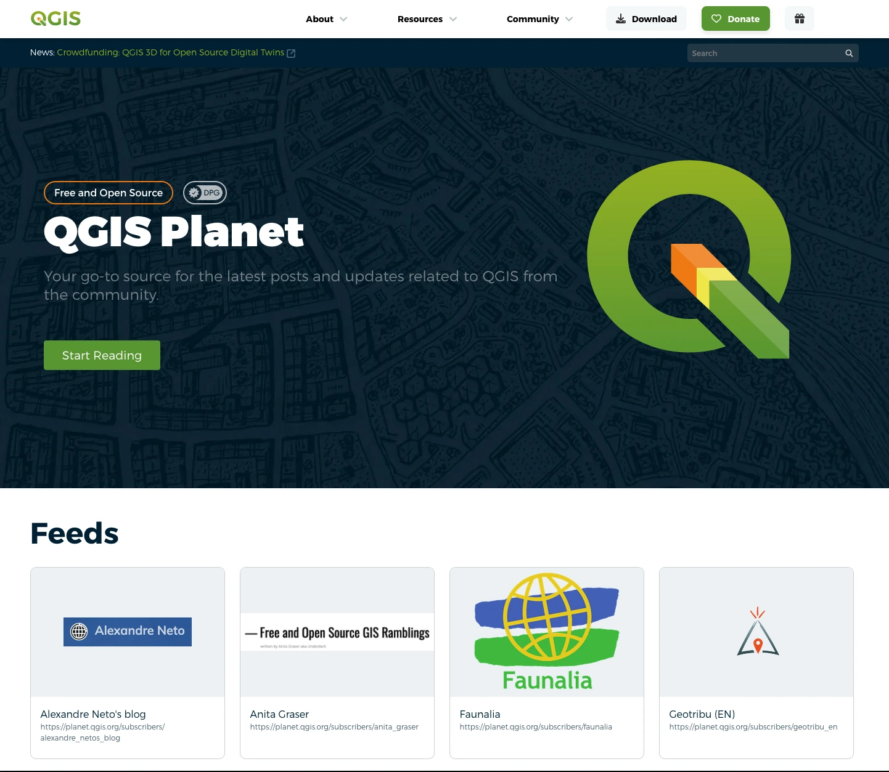

# QGIS Planet Website



By Tim Sutton and QGIS Contributors.

## Project Status

[](https://github.com/qgis/QGIS-Planet-Website/actions/workflows/github-pages.yml)


Project stars:


## 🏃Before you start

This web site is a static site built using [Hugo](https://gohugo.io/).

 and using the [hugo bulma blocks theme](https://github.com/kartoza/hugo-bulma-blocks-theme).

## 🛒 Getting the Code

development
```
git clone https://github.com/qgis/QGIS-Planet-Website.git
cd QGIS-Planet-Website
```


## 🧑💻 Development

First install hugo for your local machine:

**📝 Note:** we need to install the 'extended' hugo version which includes a SASS compiler. If you don't install the extended version you will get errors like this when compiling:

```
ERROR 2022/12/11 07:33:37 Rebuild failed: TOCSS: failed to transform 
"css/style.scss" (text/x-scss). Check your Hugo installation; you need 
the extended version to build SCSS/SASS.: this feature is not available 
in your current Hugo version, see https://goo.gl/YMrWcn for more information
```

You can find the extended version in the [releases page](https://github.com/gohugoio/hugo/releases).


### 🐧 Linux: 

Download the deb above and then do 

``sudo dpkg -i hugo_extended_0.107.0_linux-amd64.deb``

### 🪟 Windows: 

[Follow these notes](https://gohugo.io/installation/windows/)

### 🍏 macOS: 

[Follow these notes](https://gohugo.io/installation/macos/)

## ⚙️ Setting up VSCode

If you are using VSCode, I recommend the following extensions:

* Hugo Language and Syntax Support
* Color Highlight

Clone the repo:

```
git clone https://github.com/qgis/QGIS-Planet-Website.git
```

Run the site:

Press ```Ctl-Shift-D``` then choose the following runner:

'Run dev using locally installed Hugo'

the click the green triangle next to  the runner to start it.

Once the site is running, you can open it at:

<http://localhost:1313>

The site will automatically refresh any page you have open if you edit it and save your work. Magical eh?


## Content Harvesting

You can harvest data from various feeds using the `fetch_feeds.py` script. 
This script retrieves posts from each subscriber listed in `data/subscribers.json` 
and saves them to `content/posts`. 
Additionally, it fetches the sustaining members list and logos from the changelog
 website and saves them to `content/funders`.

**Note:** Any manual changes made to the files in these folders will be overwritten by this script.

```bash
./fetch_feeds.py
```

This script is run nightly as a github action (see .github/workflows/update-feeds.yml).

## Search Functionality 
The search functionality uses both [FuseJS](https://fusejs.io/) and [MarkJS](https://markjs.io/).

The search functionality code is based on this [Blog Post](https://makewithhugo.com/add-search-to-a-hugo-site/) and [GitHub Gist](https://gist.github.com/eddiewebb/735feb48f50f0ddd65ae5606a1cb41ae) by [Eddie Webb](https://twitter.com/eddturtle).

Content folders need to be excluded from search, by making them [headless bundles](https://gohugo.io/content-management/page-bundles/#headless-bundle) - which we have done for the sustaining member and flagship user folders in content/. To make other content folders which are not rendered and included in search results, add an ```index.md``` file with the following content: ```headless = true```.

## Referencing URLs in templates

The site needs to work in production, where the links of the site are all below the root URL, and in staging, where the site is deployed to GitHub pages in a subpath. To ensure both deployment strategies work, please use the following method of constructing URLs in templates.

```html
<a class="button is-primary" href="{{ "donate/" | absURL }}">
```

**Note:** We do not use a leading slash, only an ending slash.

## Styles (SASS/CSS)

SASS for most components is stored in themes/hugo-bulma-blocks-theme/assets/sass/bulma/components/

Some common styles are places in themes/hugo-bulma-blocks-theme/assets/sass/style.sass - this file is compiled as hugo template, hence has access to config.toml variables and hugo macroses

Also some bulma theme overrides are placed in themes/hugo-bulma-blocks-theme/assets/css/custom.css

## 📁 File naming conventions

* Separate words in file names with hyphens e.g. windows-download.md
* Avoid abbreviations in the words of your files
* Write file names in lower case only
* No spaces in file names


## 💮 Changing the templates

| Page type       | Path                                     |
| --------------- | ---------------------------------------- |
| Landing Page    | themes/qgis/layouts/index.html           |
| Top Level Pages | themes/qgis/layouts/_default/single.html |

## 🏠 Editing the landing (home) page

The layout of the landing page is themes/hugo-bulma-blocks-theme/layouts/index.html: the main page has many diverse blocks, that are not used anywhere else, hence its content is mostly in the partials.

The ``content/_index.md`` contains the front matter of the page and the contents for the `feature` shortcodes. Just edit whatever you like there. The blocks shortcodes are described [here](https://github.com/qgis/QGIS-Planet-Website/blob/main/docs/shortcodes.md)


## 📃 Adding a top level page

### Create the content

Content pages are stored in the ``content`` folder. The top level documents there will be rendered with the top level page theming.

For example to add an about page, create ``content/about.md``

The page will be accessible then at /about/

### 🖼️ Referencing Images and Media

Place images and media in ```static/img```. Everything in ```static``` is referenced
from the top level of the site e.g.  ```static/img/foo.png``` would be referenced in
markdown as ```/img/foo.png```.

## 📦 Blocks Shortcodes

The site uses a number of shortcodes to create reusable blocks of content. These are defined in the ```themes/hugo-bulma-blocks-theme/layouts/shortcodes/``` folder.

The shortcodes with screenshots are described [here](https://github.com/qgis/QGIS-Planet-Website/blob/main/docs/shortcodes.md)


### Sidebar

Sidebar is implemented in themes/hugo-bulma-blocks-theme/layouts/partials/sidebar.html

Items are retrieved from config.toml under `[menu]` section. `weight` parameter defines the order of the item.

To enable sidebar on the content page, use the following template:

```
---
type: "page"
...
sidebar: true
---


... add content here ...


```
